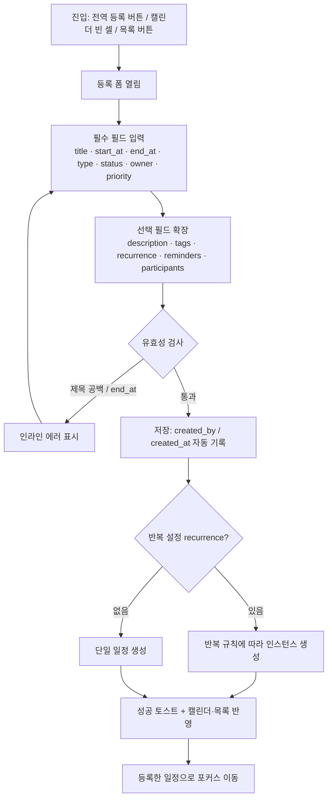

# 일정관리 시스템 — 화면 기획서 (UX/화면설계)

> 프로젝트: 02. 일정관리자
> 작성 기준일: 2026-07-15
> 기준 문서: `일정관리_시스템_필요항목_기획.md` (데이터 항목·분류체계·기능·화면구성의 단일 소스)
> 전제: 팀 협업 + 데이터 항목 중심. MVP 우선. 필드키·상태값·유형값은 기준 문서 정의를 그대로 사용.

이 문서는 기준 문서 6장(화면 구성)을 실제 설계 수준으로 전개한 것입니다. 개인용으로 축소할 경우 담당자(`owner`)·참석자(`participants`)·권한(`role`) 관련 영역을 숨기면 동일한 구조가 그대로 동작하도록 설계했습니다.

**MVP 핵심 필드**: `title` · `start_at` · `end_at` · `type` · `status` · `owner` · `priority` · `notes`
아래 화면들은 이 8개 필드를 최우선으로 노출하고, 나머지 필드(`description`, `tags`, `recurrence`, `progress`, `participants`, `location`, `reminders`, `attachments`, `color`, `due_date`, `is_all_day`, `project_id`)는 상세/확장 영역에 단계적으로 배치합니다.

---

## 1. 정보구조(IA) / 화면 목록

일정관리는 "언제(시간축)"와 "무엇을(항목축)" 두 관점의 반복 전환이 핵심입니다. 따라서 최상위 내비게이션을 시간축(캘린더)·항목축(목록)·요약축(대시보드)으로 나란히 두어, 사용자가 목적에 따라 즉시 전환하도록 설계합니다.

```
일정관리자
├─ 대시보드(홈)              오늘·이번 주를 한눈에 요약해 하루의 진입점을 제공
├─ 캘린더                    시간축 배치. 월/주/일 전환으로 일정의 밀도와 충돌을 시각화
│   └─ (일정 상세 패널)      캘린더 블록 클릭 시 우측 슬라이드로 상세 표시
├─ 목록(리스트)             항목축 배치. 정렬·필터·일괄관리로 대량 일정을 관리
│   └─ (일정 상세 패널)      행 클릭 시 상세 표시
├─ 일정 등록·상세           기준 문서 1장 필드를 입력·수정하는 폼(신규=등록, 기존=상세/수정)
├─ 검색·필터                유형·상태·기간·담당자·태그 조합 검색 (전역 검색 바 + 결과)
└─ 설정                     분류값·알림 기본값·사용자/권한·색상 규칙 관리
    ├─ 분류값 관리          type/status/priority 선택값과 색상 매핑
    ├─ 알림 기본값          reminders 기본 프리셋
    ├─ 사용자·권한          user/role (관리자·편집자·뷰어)
    └─ 색상 규칙            유형/우선순위 ↔ color 연동 규칙
```

| 화면 | 목적(한 줄) |
|---|---|
| 대시보드(홈) | 오늘·이번 주 일정과 마감 임박·상태별 건수를 요약해 하루의 시작점을 제공 |
| 캘린더 | 월/주/일 뷰에서 일정을 시간축에 배치하고 클릭·드래그로 조작 |
| 목록(리스트) | 표 형태로 정렬·필터·일괄관리하며 대량 일정을 다룸 |
| 일정 등록·상세 | 일정 하나의 전체 필드를 입력·수정하고 반복·알림·참석자를 설정 |
| 검색·필터 | 여러 조건을 조합해 원하는 일정을 빠르게 찾음 |
| 설정 | 분류값·알림·권한·색상 등 시스템 기준을 관리 |

내비게이션 우선순위는 **대시보드 → 캘린더 → 목록**입니다. 등록은 어느 화면에서든 항상 도달 가능해야 하므로, 전역 우상단 고정 "＋ 일정 등록" 버튼(FAB 성격)으로 분리해 IA 트리 밖에 항상 노출합니다.

---

## 2. 화면 흐름 (플로우)

### 흐름 A — 일정 등록 (신규 생성)
사용자가 새 일정을 만드는 가장 빈번한 경로입니다. 진입 지점을 여러 곳에 두되 최종 폼은 하나로 통일해 학습 비용을 낮춥니다.

```
진입(전역 "＋ 일정 등록" / 캘린더 빈 셀 클릭 / 목록 상단 버튼)
  → 등록 폼 열림(우측 패널 또는 모달)
  → 필수 필드 입력: title · start_at · end_at · type · status(기본 예정) · owner · priority
  → [옵션] description · tags · recurrence · reminders · participants · location 확장 입력
  → 유효성 검사(제목 공백? end_at ≥ start_at?)
     ├─ 실패 → 인라인 에러 표시, 저장 차단
     └─ 통과 → 저장(created_by·created_at 자동 기록)
  → 성공 토스트 + 방금 등록한 일정으로 포커스 이동(캘린더/목록에 반영)
```

### 흐름 B — 일정 검색 → 수정
이미 존재하는 일정을 찾아 고치는 경로. 검색 결과에서 상세로, 상세에서 편집으로 마찰 없이 이어지도록 합니다.

```
전역 검색 바에 키워드 입력(title/description/notes 대상)
  → [옵션] 필터 조합: type · status · 기간(start_at) · owner · tags
  → 결과 목록(뱃지로 status/priority 즉시 식별)
  → 항목 클릭 → 상세 패널 열림(전체 필드 읽기 모드)
  → "수정" 클릭 → 편집 모드 전환
  → 값 변경(예: status 예정→진행중, owner 재지정)
  → 저장(updated_at 자동 갱신)
  → 상세 패널 읽기 모드로 복귀 + 변경 반영 토스트
```

### 흐름 C — 캘린더에서 상태 변경 (인라인 조작)
캘린더 뷰를 벗어나지 않고 상태만 빠르게 바꾸는 경로. 반복 업무의 완료 처리 등 고빈도 액션을 최소 클릭으로 지원합니다.

```
캘린더에서 일정 블록 클릭
  → 미니 팝오버 표시(title · 시간 · 현재 status/priority 뱃지)
  → status 드롭다운에서 값 선택(예: 진행중 → 완료)
  → 즉시 저장(updated_at 갱신) + 블록 색/뱃지 실시간 변경
  → [완료 시] 블록에 완료 스타일(취소선/체크) 적용
  * 드래그로 블록 이동 시 start_at·end_at 동시 조정(확장 기능)
```

### 흐름 D (Mermaid) — 등록·저장 전체 플로우



---

## 3. 화면별 상세 기획

각 화면은 **레이아웃 영역 / 컴포넌트 / 표시 필드(필드키 매핑) / 인터랙션 / 상태별 UI(빈·로딩·에러)** 순으로 기술합니다.

### 3.1 대시보드(홈)

하루의 진입점이므로 "지금 내가 신경 써야 할 것"을 위에서 아래로 긴급도 순으로 쌓습니다. 상단 요약 지표 → 마감 임박 → 오늘 일정 → 내 담당 순서는, 훑어보는 시선(F-패턴)에 맞춰 의사결정에 필요한 정보를 먼저 노출하기 위함입니다.

**레이아웃 영역**
- 상단: 인사/날짜 + 상태별 건수 요약 카드 행(KPI)
- 좌측(넓은 열): 오늘 일정 타임라인, 이번 주 미리보기
- 우측(좁은 열): 마감 임박(`due_date` 순), 내 담당(`owner`=나) 일정

**컴포넌트**
- 상태별 건수 요약 카드 (예정/진행중/완료/보류/취소 각 카운트)
- 오늘 일정 타임라인 리스트
- 마감 임박 카드 리스트
- 내 담당 일정 리스트
- 빠른 등록 버튼

**표시 필드**

| 영역 | 표시 필드(필드키) |
|---|---|
| 상태별 요약 | `status` 별 count |
| 오늘 타임라인 | `title`, `start_at`, `end_at`, `type`, `status`, `priority`, `owner` |
| 마감 임박 | `title`, `due_date`, `status`, `priority` |
| 내 담당 | `title`, `start_at`, `status`, `priority`, `owner` |

**주요 인터랙션**
- 요약 카드 클릭 → 해당 `status`로 필터된 목록 화면 이동
- 일정 항목 클릭 → 상세 패널
- 빠른 등록 → 등록 폼

**상태별 UI**
- 빈 상태: "오늘 예정된 일정이 없습니다" + "＋ 일정 등록" CTA
- 로딩: 카드/리스트 자리에 스켈레톤
- 에러: "데이터를 불러오지 못했습니다" + 재시도 버튼

### 3.2 캘린더

시간축에서 일정의 밀도·충돌·여백을 보는 화면이므로 그리드 가독성이 최우선입니다. 뷰 전환(월/주/일)과 기간 이동을 상단 한 줄에 모아 손이 자주 가는 컨트롤을 고정 위치에 둡니다.

**레이아웃 영역**
- 상단 툴바: 월/주/일 전환, 이전/다음/오늘 이동, 기간 라벨, 필터 진입, 등록 버튼
- 본문: 캘린더 그리드(월=날짜 셀, 주/일=시간축 열)
- 우측(선택): 일정 클릭 시 상세 슬라이드 패널

**컴포넌트**
- 뷰 전환 세그먼트 컨트롤(월/주/일)
- 기간 네비게이터(◀ 오늘 ▶)
- 일정 블록(색/뱃지 규칙은 4장)
- 미니 팝오버(빠른 상태 변경)
- 필터 드로어

**표시 필드**

| 요소 | 표시 필드(필드키) |
|---|---|
| 일정 블록 | `title`, `start_at`, `end_at`, `is_all_day`, `type`, `status`, `priority`, `color` |
| 블록 뱃지 | `status`, `priority` (색/아이콘) |
| 팝오버 | `title`, `start_at`~`end_at`, `owner`, `status`, `priority`, `location` |

**주요 인터랙션**
- 빈 셀 클릭 → 해당 시간으로 `start_at` 프리필된 등록 폼
- 블록 클릭 → 팝오버(빠른 status 변경) / "상세" 클릭 시 상세 패널
- 블록 드래그 → `start_at`·`end_at` 이동, 가장자리 리사이즈 → 기간 조정(확장 기능)
- 월↔주↔일 전환 시 동일 기준일 유지

**상태별 UI**
- 빈 상태: 그리드는 유지하되 일정 0건이면 "이 기간에 일정이 없습니다" 안내
- 로딩: 그리드 위 반투명 로더(레이아웃 시프트 방지)
- 에러: 그리드 상단 배너 + 재시도

### 3.3 목록(리스트)

대량 일정을 항목축에서 처리하는 화면으로, 정렬·필터·일괄 선택이 핵심입니다. 좌측에 식별 정보(제목/유형), 우측에 상태·기한을 두어 스캔 중 판단에 필요한 값이 시선 끝에 오도록 배치합니다.

**레이아웃 영역**
- 상단 바: 필터 칩, 정렬 드롭다운, 검색 진입, 일괄 액션 바(선택 시 노출)
- 본문: 데이터 테이블(행=일정)
- 페이지네이션/무한 스크롤

**컴포넌트**
- 필터 칩(type/status/priority/기간/owner/tags)
- 정렬 컨트롤(start_at, due_date, priority, updated_at 기준)
- 체크박스(다중 선택) + 일괄 액션(상태 변경/삭제)
- 상태·우선순위 뱃지
- 행 클릭 시 상세 패널

**표시 필드(컬럼)**

| 컬럼 | 필드키 |
|---|---|
| 제목 | `title` |
| 유형 | `type` |
| 시작~종료 | `start_at` / `end_at` |
| 상태 | `status` (뱃지) |
| 우선순위 | `priority` (뱃지) |
| 담당자 | `owner` |
| 마감 | `due_date` |
| 태그 | `tags` |

**주요 인터랙션**
- 컬럼 헤더 클릭 정렬, 필터 칩으로 즉시 필터
- 행 체크 → 일괄 `status` 변경/삭제
- 행 클릭 → 상세 패널, "수정"으로 편집

**상태별 UI**
- 빈 상태: 필터 결과 0건이면 "조건에 맞는 일정이 없습니다 · 필터 초기화" / 전체 0건이면 첫 등록 유도
- 로딩: 테이블 로우 스켈레톤
- 에러: 테이블 영역 인라인 에러 + 재시도

### 3.4 일정 등록·상세

한 일정의 전체 필드를 다루는 화면. 신규는 등록, 기존은 읽기→수정 모드를 공유합니다. MVP 필드를 상단 기본 영역에, 확장 필드를 접이식 섹션에 두어 초심자는 짧게, 파워유저는 깊게 쓰도록 점진적 노출(progressive disclosure)합니다.

**레이아웃 영역**
- 헤더: 제목 입력/표시 + 저장·취소(또는 수정·삭제)
- 기본 영역(항상 노출): 필수/MVP 필드
- 확장 섹션(접이식): 분류·반복·사람·알림·부가
- 우측(상세 모드): 메타 정보(생성/수정 이력)

**컴포넌트 & 표시 필드**

| 섹션 | 컴포넌트 | 필드키 | 필수 |
|---|---|---|---|
| 기본 | 텍스트 입력 | `title` | ● |
| 기본 | 긴 텍스트 | `description` | ○ |
| 일시 | 날짜+시간 피커 | `start_at`, `end_at` | ● |
| 일시 | 토글 | `is_all_day` | ○ |
| 일시 | 날짜 피커 | `due_date` | ○ |
| 일시 | 반복 규칙 빌더 | `recurrence` (주기·요일·간격·종료조건·예외) | ○ |
| 분류 | 드롭다운 | `type` (업무/회의/외부/개인/마감/휴가/기타) | ● |
| 분류 | 참조 선택 | `project_id` | ○ |
| 분류 | 다중 태그 | `tags` | ○ |
| 상태 | 세그먼트/드롭다운 | `status` (예정/진행중/완료/보류/취소) | ● |
| 상태 | 세그먼트 | `priority` (높음/중간/낮음) | ○ |
| 상태 | 슬라이더/숫자 | `progress` (0~100) | ○ |
| 사람 | 사용자 선택 | `owner` | ○(MVP 노출) |
| 사람 | 다중 사용자 | `participants` | ○ |
| 장소 | 텍스트/URL | `location` | ○ |
| 알림 | 다중 프리셋 | `reminders` (10분 전/1일 전 등) | ○ |
| 부가 | 파일 업로드 | `attachments` | ○ |
| 부가 | 색상 선택 | `color` | ○ |
| 부가 | 긴 텍스트 | `notes` | ○ |
| 시스템 | 읽기 전용 | `created_by`, `created_at`, `updated_at` | 자동 |

**주요 인터랙션**
- `is_all_day` ON → 시간 입력 숨기고 날짜 단위 처리
- `type`/`priority` 선택 시 `color` 자동 제안(색상 규칙 연동, 사용자 수동 변경 가능)
- `recurrence` 설정 시 종료조건 미지정 경고
- 저장: 유효성 통과 시 `created_at`/`updated_at` 자동 기록
- 삭제: 확인 다이얼로그(반복 일정이면 "이 일정만 / 이후 전체" 선택)

**상태별 UI**
- 빈 상태(신규): 기본 영역만 펼치고 확장 섹션 접힘, 필수 필드 표시
- 로딩(상세 진입): 폼 스켈레톤
- 에러: 필드 인라인 에러(예: `end_at`이 `start_at`보다 이름) + 저장 버튼 비활성. 저장 실패 시 상단 배너 + 입력값 보존

---

## 4. 컴포넌트/UI 규칙

### 4.1 상태(`status`) 뱃지 규칙
기준 문서 3장의 색상 권장안을 그대로 채택합니다. 색만으로 구분하지 않고 라벨/아이콘을 병기해 색각 이상 사용자도 구분 가능하게 합니다(접근성).

| status | 라벨 | 색상 | 표기 |
|---|---|---|---|
| 예정(To Do) | 예정 | 중립 남색/기본 | 외곽선 또는 옅은 채움 |
| 진행중(In Progress) | 진행중 | 파랑 | 채움 뱃지 |
| 완료(Done) | 완료 | 초록 | 채움 + 체크 아이콘 |
| 보류(On Hold) | 보류 | 회색 | 채움 |
| 취소(Canceled) | 취소 | 옅은 빨강 | 채움 + 취소선(텍스트) |

### 4.2 우선순위(`priority`) 뱃지 규칙

| priority | 라벨 | 색상 | 표기 |
|---|---|---|---|
| 높음 | 높음 | 빨강 | 채움 뱃지 + 상단 강조 |
| 중간 | 중간(기본값) | 노랑/앰버 | 옅은 채움 |
| 낮음 | 낮음 | 회색 | 외곽선 |

### 4.3 유형(`type`) 규칙
유형은 색보다 형태·아이콘으로 구분하고, `color`는 유형에 기본 매핑하되 개별 일정에서 덮어쓸 수 있습니다. 상태·우선순위와 색이 충돌하지 않도록 캘린더 블록의 **바탕색=유형/`color`**, **좌측 컬러바=우선순위**, **뱃지=상태**로 역할을 분리합니다.

| type | 아이콘(예) | 기본 color |
|---|---|---|
| 업무 태스크 | 체크 | 남색 |
| 회의/미팅 | 사람 | 보라 |
| 외부 약속 | 링크 | 청록 |
| 개인 일정 | 원 | 회록 |
| 마감/데드라인 | 깃발 | 빨강 |
| 휴가/부재 | 비행기 | 옅은 회색 |
| 기타 | 점 | 중립 |

### 4.4 캘린더 일정 블록 표기 규칙
- **좌측 컬러바(2~3px)** = `priority` (높음일수록 진하게)
- **바탕색** = `color`(없으면 `type` 기본색)
- **본문** = `title` + 시간(`start_at`~`end_at`), 공간 부족 시 시간 생략 후 툴팁
- **우측 상단 뱃지** = `status`(완료=체크, 취소=취소선/흐림 처리)
- **종일(`is_all_day`)** = 그리드 상단 종일 영역에 막대(bar) 형태로 별도 표시
- **반복(`recurrence`)** = 순환 아이콘 부착
- 겹침 시 주/일 뷰에서 폭 분할, 월 뷰에서 "＋N건 더" 요약 칩

### 4.5 반응형 원칙 (데스크탑/모바일)
정보 밀도가 높은 도구이므로 데스크탑은 다중 컬럼·상시 사이드바, 모바일은 단일 컬럼·순차 접근으로 재구성합니다.

| 항목 | 데스크탑(≥1024) | 모바일(<768) |
|---|---|---|
| 내비게이션 | 좌측 사이드바 상시 | 하단 탭바(대시보드/캘린더/목록/등록) |
| 캘린더 기본 뷰 | 월 뷰 | 일/주 뷰(월은 축약 도트) |
| 목록 | 다중 컬럼 테이블 | 카드형 1열(제목+상태 뱃지 우선) |
| 상세 | 우측 슬라이드 패널 | 전체 화면 전환 |
| 등록 | 모달/우측 패널 | 전체 화면 폼, 확장 섹션 아코디언 |
| 등록 버튼 | 우상단 고정 | 우하단 FAB |

터치 타깃 최소 44px, 드래그 이동은 데스크탑 우선(모바일은 롱프레스 후 이동)으로 둡니다.

---

## 5. 개발 연계 메모 (화면 ↔ 필드 매핑 요약)

개발/프로토타입에서 각 화면이 어떤 필드를 읽고 쓰는지 요약합니다. ●=주 표시/입력, ○=보조/확장, R=읽기전용(자동).

| 필드키 | 대시보드 | 캘린더 | 목록 | 등록·상세 |
|---|:--:|:--:|:--:|:--:|
| `title` | ● | ● | ● | ● |
| `description` | | | | ● |
| `type` | ○ | ● | ● | ● |
| `project_id` | | | ○ | ○ |
| `tags` | | | ● | ○ |
| `start_at` | ● | ● | ● | ● |
| `end_at` | ○ | ● | ● | ● |
| `is_all_day` | | ● | ○ | ○ |
| `due_date` | ● | ○ | ● | ○ |
| `recurrence` | | ●(아이콘) | | ● |
| `status` | ● | ● | ● | ● |
| `priority` | ● | ● | ● | ○ |
| `progress` | ○ | | ○ | ○ |
| `owner` | ● | ○ | ● | ○ |
| `participants` | | ○ | | ○ |
| `location` | | ○ | | ○ |
| `reminders` | | | | ○ |
| `attachments` | | | | ○ |
| `color` | | ● | | ○ |
| `notes` | | | | ● |
| `created_by` | | | | R |
| `created_at` | | | | R |
| `updated_at` | | | ○(정렬) | R |

**개발 유의 사항(핵심 3)**
1. **필수 유효성은 서버·클라이언트 이중 검증**: `title` 비어있음 금지, `end_at ≥ start_at`, `status`/`type`는 3장 정의된 열거값만 허용. 위반 시 인라인 에러로 저장 차단.
2. **상태/우선순위/유형은 열거형(enum) + 색상 매핑 테이블**로 관리: 값과 색을 코드에 하드코딩하지 말고 설정(4장/설정 화면)에서 주입해 뱃지·캘린더 블록이 동일 소스를 참조하게 함. 색상은 라벨/아이콘과 병기(접근성).
3. **저장 시 시스템 필드 자동 처리**: 신규는 `created_by`/`created_at`, 수정은 `updated_at` 자동 기록. 반복 일정(`recurrence`)은 인스턴스 생성·"이 일정만/이후 전체" 수정·삭제 분기를 데이터 모델 단계에서 설계.

---

### 부록 — 개인용 축소 시
`owner`·`participants`·`role`(권한)·공유 관련 영역을 숨기면 동일 IA로 개인용 전환 가능. 프로젝트 관리 중심으로 확장할 경우 `due_date`·`progress`·`project_id`를 목록·대시보드의 주 표시 필드로 승격.
